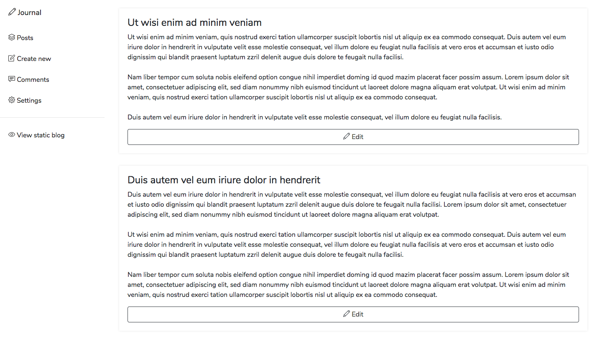
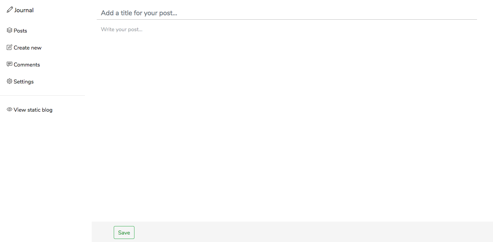

<p align="center"></p>

Table of Contents
- [About Journal](#about-journal)
- [Features](#features)
- [Installing Journal](#installing-journal)
- [Screenshots](#screenshots)
- [Security](#security)
- [Official themes](#official-themes)
- [Comments](#comments)
- [Automatic uploading](#automatic-uploading)
- [How can I publish my blog on...](#how-can-i-publish-my-blog-on)
    - [...my (S)FTP server, AWS S3 Bucket or DigitalOcean Spaces](#my-sftp-server-aws-s3-bucket-or-digitalocean-spaces)
    - [...Netlify](#netlify)
    - [...GitHub Pages](#github-pages)
    - [...Dropbox or my WebDAV server](#dropbox-or-my-webdav-server)
- [Custom themes](#custom-themes)
        - [base.html](#basehtml)
        - [home.html](#homehtml)
        - [post.html](#posthtml)
        - [assets/](#assets)
    - [Theme watcher](#theme-watcher)
- [Upcomming features](#upcomming-features)
- [License](#license)

# About Journal
Journal is a simple CMS for static blogs. It aims to simplify the creation and maintenance of a blog that only uses static html, js and css files.

# Features
- Simple, minimalistic dashboard
- Easy-to-use dashboard
- Easy installation
- [Automatic upload of static blog files to server](#automatic-uploading)
- No SQL-/Database-Server required
- [Comment support through Disqus](#comments)
- Custom theme support
- Easy theme developement through [theme watcher](#theme-watcher)
- Build-in updater

# Installing Journal
1. Download the latest release from [https://github.com/vantezzen/journal/releases](https://github.com/vantezzen/journal/releases) or - if you're feeling dangerous - download the current developement version from [https://github.com/vantezzen/journal/archive/master.zip](https://github.com/vantezzen/journal/archive/master.zip). If you download a release version you can choose between the GitHub version (`Source Code`) or a full Journal version with composer dependencies pre-installed (`Full`).
2. If you downloaded the `Source Code` release or the developement version you'll have to install composer dependencies via `composer install`. If you downloaded the `Full` release version this step is not required.
3. Unpack the files to a local PHP server and make sure PHP can read and write to these folders:
    - public/
    - tables/
4. Open index.php through your webserver and start using Journal
5. Once you create a new post you'll see files in the public/ folder. This is where Journal will put your static blog files. You can now upload these files to a static webserver.

# Screenshots
<p align="center"></p>
"Posts" list. This is where you can see all your posts and edit them.
<p align="center"></p>
Create post

# Security
Journals dashboard is **_in no way_** meant to be used on a public server. There is no login screen, your settings (including server credentials when using automatic uploading) are stored in plain text in a publicly availible folder. Please **_only_** use Journal on a local or otherwise protected webserver.

Please note that these warning do not apply to the final static files stored in the `public/` folder.

# Official themes
- default (build-in, very simple theme to get developers started)
- [clean_blog](https://github.com/vantezzen/journal-cleanblog)

# Comments
Journal allows you to add a Disqus comment section to every post. To activate comments, in your Journal dashboard, go to "Comments", as the Provider select "Disqus". You then need to get the identifier of your Disqus admin account (`my-blog-6`.disqus.com). After saving, the comments section shoud appear at the end of your post.

# Automatic uploading
Journal can upload files to your webserver. To activate this feature, in your Journal dashboard, go to "Upload", choose an upload method (FTP, SFTP etc.) and enter your server credentials. 

Journal currently supports the following upload methods:
- FTP
- SFTP
- Amazon AWS S3
- DigitalOcean Spaces

You should now see a "Upload files to server" button on your "Posts" page. When clicked, Journal will upload your current static files to your server, overwriting the old ones but not deleting any other files.

# How can I publish my blog on...
After creating your blog you can publish it using different methods - here are the most common ones:
## ...my (S)FTP server, AWS S3 Bucket or DigitalOcean Spaces
Journal supports automatic uploading to (S)FTP servers, AWS S3 Buckets and DigitalOcean Spaces. You can activate it in Journals' settings under "Upload".

## ...Netlify
Unfortunately, Journal does not support Netlify by default. You can however create a new git repository in Journals' `public/` directory and manually commit and push changes to your blog - changes should only happen when you change Journals' settings or create or edit post.
You can now choose this git repository as your Netlify repository.

## ...GitHub Pages
See [How can I publish my blog on Netlify](#netlify).

## ...Dropbox or my WebDAV server
Dropbox and WebDAV support will be added in one of the next versions of Journal.

# Custom themes
Journal allows for the creation of custom themes. It utilizes [Mustache](https://mustache.github.io/) to turn themes into pages. To see an example theme, look at `themes/default/`.
Every theme has its own folder in `themes/` with its name. It is highly adviced to have a basic understanding of the syntax of [Mustache](https://mustache.github.io/) before creating custom themes.

Journal requires the following files and folders to be existent in a themes folder:

### base.html
This files holds a scaffold and will be wrapped around every other page. Journal will also require you to have a '{{{ content }}}' tag in your base.html in which other pages will be inserted. 
Availible variables are:
- content : Code for the page that will be inserted
- title : Title of the page
- description : Blog description
- copyright : Blog copyright text
- language : Language code of the blogs language (for use in html lang tag)
- url : URL of the final blog (e.g. https://example.com)
  
Availible methods are:
- include : Include another .html file
  
Example base.html
```html
<!DOCTYPE html>
<html lang="{{ language }}">
<head>
    <meta charset="UTF-8">
    <meta name="viewport" content="width=device-width, initial-scale=1.0">
    <meta http-equiv="X-UA-Compatible" content="ie=edge">
    <title>{{ title }}</title>
</head>
    <body>
        {{# include }}
            parts/nav
        {{/ include }}

        {{{ content }}}

        {{# include }}
            parts/footer
        {{/ include }}
    </body>
</html>
```
### home.html
This file will be used to create your blog homepage. A `post` area should be created. This area will be repeated for every post. This page will be wrapped inside base.html.

Availible variables are:
- post : Array of all posts
- title : Blog title
- description : Blog description
- copyright : Blog copyright text

Inside `post` you can use:
- title : Title of the post. This should always be inserted using triple-brackets as the title has already been escaped
- text : Full post text.This should always be inserted using triple-brackets as the title has already been escaped
- `trimmedText` method : Only get a trimmed text of sepecified length (see example)
- path : Relative path to the post (e.g. my-post.html)
- url : Absolute URL to the psot (e.g. https://example.com/my-post.html)
- id : ID of the post

Example home.html
```html
<h1>Home</h1>

{{# post }}
<h1>{{{ title }}}</h1>
<p>{{# trimmedText}}150{{/ trimmedText}}</p>
<a href="{{ path }}">Open post</a>
<a href="{{ url }}">Absolute URL</a>
{{/ post }}

{{^ post }}
<b>There are no posts yet!</b>
{{/ post }}
```
### post.html
This file will be used to create pages for all posts. This page will be wrapped inside base.html.

Availible variables are:
- title : Title of the post. This should always be inserted using triple-brackets as the title has already been escaped
- text : Full post text.This should always be inserted using triple-brackets as the title has already been escaped
- path : Relative path to the post (e.g. my-post.html)
- url : Absolute URL to the psot (e.g. https://example.com/my-post.html)
- comments : Code for comment section*

You should add a triple-bracketed `comments` to your post.html to add support for a comment section. This will be replaced with the comments section of the chosen comment provider when generating static pages. 

Example post.html
```html
<h1>{{{ title }}}</h1>
<p>{{{ text }}}</p>

{{{ comments }}}
```
### assets/
The assets folder should contain all additional assets that are required for the theme (i.e. css and js files). This folder will be copied to public/assets/ automatically.

Example assets/
```
assets/
    css/
        style.css
        bootstrap.min.css
    js/
        plugins.js
        main.js
        jquery.min.js
        bootstrap.min.js
```

## Theme watcher
When developing themes it can get very annoying to regenerate static blog files on every change in the theme. To help with this work, Journal comes with a theme watcher. The theme watcher will watch for changes in your theme folder and automatically regenerate the static blog files.
Journals theme watcher is build with Node.JS. You will first need to install its dependencies with
```bash
npm install
``` 
You can then start the theme watcher via
```bash
npm run watch [theme name]
```
replacing `[theme name]` with the name of your themes folder.

Theme watcher will now watch your folder and trigger a regeneration when a file changes. It is not required to change Journals theme to the developed theme - it will automatically be used for regeneration of static files when using the theme watcher.

# Upcomming features
These features are planned for the next versions of Journal
- Menu settings for themes (=> Add custom links to menus)
- More upload methods (ZIP Archive, WebDAV, Git)
- Pagination support

# License

Journal is open-sourced software licensed under the [MIT license](https://opensource.org/licenses/MIT).